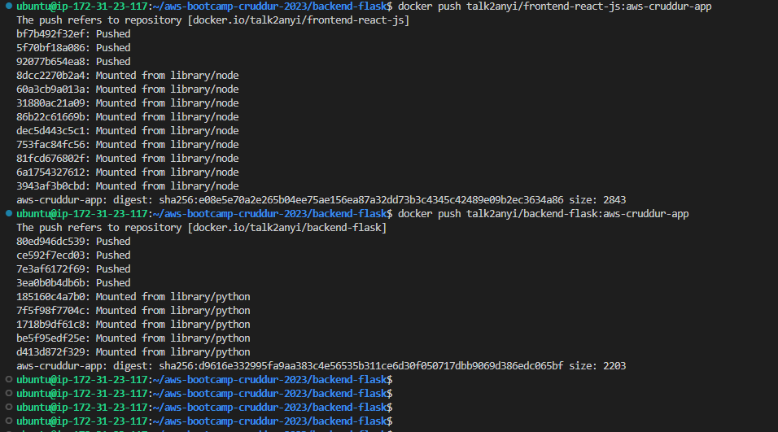
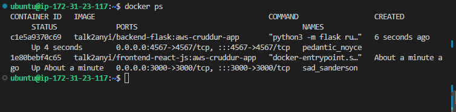
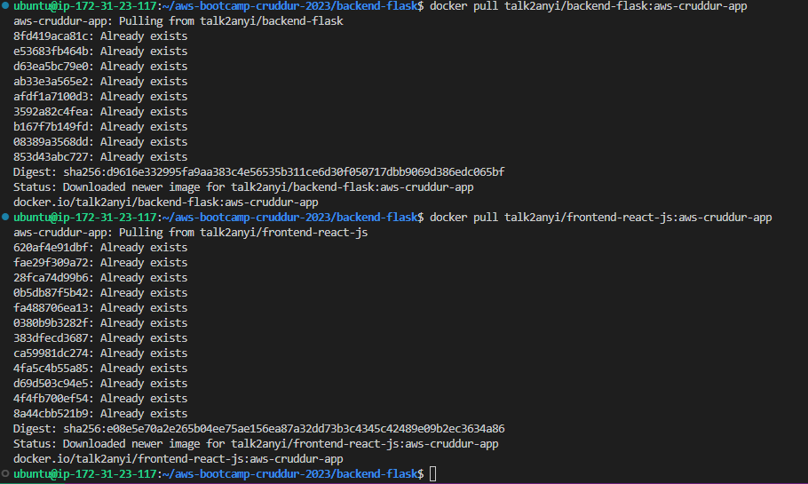

# Week 1 — App Containerization

## Homework Challenges 

### Push and tag an image to DockerHub (they have a free tier)

I pushed and tagged both the frontend-react-js and backend-flask images to dockerhub




### Learn how to install Docker on your local machine and get the same containers running outside of Gitpod / Codespaces

I created a script to install docker on my machine
```sh
#!/bin/bash
sudo apt-get update -y
sudo apt-get install \
    ca-certificates \
    curl \
    gnupg \
    lsb-release -y

sudo mkdir -m 0755 -p /etc/apt/keyrings
curl -fsSL https://download.docker.com/linux/ubuntu/gpg | sudo gpg --dearmor -o /etc/apt/keyrings/doc>

echo \
  "deb [arch=$(dpkg --print-architecture) signed-by=/etc/apt/keyrings/docker.gpg] https://download.do>
  $(lsb_release -cs) stable" | sudo tee /etc/apt/sources.list.d/docker.list > /dev/null

sudo chmod a+r /etc/apt/keyrings/docker.gpg

sudo apt-get update

sudo apt-get install docker-ce docker-ce-cli containerd.io docker-buildx-plugin docker-compose-plugin

echo 'Docker installed'

# Add current user to the docker group (to avoid needing to use 'sudo' for Docker commands)
sudo usermod -aG docker $USER

# Verify installation
docker --version
```
I ran the script using `sh <scriptName.sh>` 

I built the images for the frontend and backend application `docker build -t <repositoryName/imageName:tag>`

I started and ran the containers for the application locally `docker run -d -p` commands 




### Launch an EC2 instance that has docker installed, and pull a container to demonstrate you can run your own docker processes. 

I launched an EC2 instance and pulled an image from the docker registry




## Required Homework Tasks

## Containerize the Application using Dockerfiles & Docker Compose

## Containerize Backend 


### Add Dockerfile

Create a file here: `backend-flask/Dockerfile`

```dockerfile
FROM python:3.10-slim-buster

WORKDIR /backend-flask

COPY requirements.txt requirements.txt
RUN pip3 install -r requirements.txt

COPY . .

ENV FLASK_ENV=development

EXPOSE ${PORT}
CMD [ "python3", "-m" , "flask", "run", "--host=0.0.0.0", "--port=4567"]
```

### Build Container

```sh
docker build -t  backend-flask ./backend-flask
```

### Run Container (interactive mode)

Run 
```sh
export FRONTEND_URL="*"
export BACKEND_URL="*"
docker run --rm -p 4567:4567 -it  -e FRONTEND_URL -e BACKEND_URL backend-flask

# To remove the environment variables set earlier
unset FRONTEND_URL="*"
unset BACKEND_URL="*"
```
> or 
```sh
docker run --rm -p 4567:4567 -it -e FRONTEND_URL='*' -e BACKEND_URL='*' backend-flask
```


Run container (in background mode)
```sh
docker container run --rm -p 4567:4567 -d backend-flask
```

### Accessing Web Page

- Select the Ports tab next to the terminal tab
- Click the padlock sign to unlock the port
- Click open in browser icon to open the webpage
- Add `/api/activities/home` to the endpoint


### Get Container Images or Running Container Ids

```
docker ps
docker images
docker ps -a
```


### Send Curl to Test Server

```sh
curl -X GET http://localhost:4567/api/activities/home -H "Accept: application/json" -H "Content-Type: application/json"
```

### Check Container Logs

```sh
docker logs CONTAINER_ID -f
docker logs backend-flask -f
docker logs $CONTAINER_ID -f
```

### Gain Access to a Container

```sh
docker exec CONTAINER_ID -it /bin/bash
```

> You can just right click a container and see logs in VSCode with Docker extension

### Delete an Image

```sh
docker image rm -f backend-flask 
```


## Containerize Frontend

### Create Docker File

Create a file here: `frontend-react-js/Dockerfile`

```dockerfile
FROM node:16.18

ENV PORT=3000

COPY . /frontend-react-js
WORKDIR /frontend-react-js
RUN npm install
EXPOSE ${PORT}
CMD ["npm", "start"]
```

### Build Container

```sh
docker build -t frontend-react-js ./frontend-react-js
```

### Run Container

```sh
docker run -p 3000:3000 -d frontend-react-js
```

### Accessing Web Page

- Select the Ports tab next to the terminal tab
- Click the padlock sign to unlock the port
- Click open in browser icon to open the webpage


## Running Multiple Containers

### Create a docker-compose file

Create `docker-compose.yml` at the root of your project.

```yaml
version: "3.8"
services:
  backend-flask:
    environment:
      FRONTEND_URL: "https://3000-${GITPOD_WORKSPACE_ID}.${GITPOD_WORKSPACE_CLUSTER_HOST}"
      BACKEND_URL: "https://4567-${GITPOD_WORKSPACE_ID}.${GITPOD_WORKSPACE_CLUSTER_HOST}"
    build: ./backend-flask
    ports:
      - "4567:4567"
    volumes:
      - ./backend-flask:/backend-flask
  frontend-react-js:
    environment:
      REACT_APP_BACKEND_URL: "https://4567-${GITPOD_WORKSPACE_ID}.${GITPOD_WORKSPACE_CLUSTER_HOST}"
    build: ./frontend-react-js
    ports:
      - "3000:3000"
    volumes:
      - ./frontend-react-js:/frontend-react-js

# the name flag is a hack to change the default prepend folder
# name when outputting the image names
networks: 
  internal-network:
    driver: bridge
    name: cruddur
```


## Document the Notification Endpoint for the OpenAI Document

Go to: `backend-flask/openapi-3.0.yml`

Create an endpoint for notifications tab by adding a new path

```py
  /api/activities/notifications:
    get:
      description: 'Return a feed of activity for all those that I follow'
      tags:
        - activities 
      parameters: []
      responses:
        '200':
          description: Returns an array of activities
          content:
            application/json:
              schema:
                type: array
                items:
                  $ref: '#/components/schemas/Activity'
```


## Write a Flask Backend Endpoint for Notifications

Go to: `backend-flask/app.py`

Import the notifications service into `app.py`

```py
from services.notifications_activities import *
```

Create a route for the notification activities

```py
@app.route("/api/activities/notifications", methods=['GET'])
def data_notifications():
  data = NotificationsActivities.run()
  return data, 200
```

Go to: `backend-flask/services` and create file `notifications_activities.py`

Paste this code in to create the notifications service

```py
from datetime import datetime, timedelta, timezone
class NotificationsActivities:
  def run():
    now = datetime.now(timezone.utc).astimezone()
    results = [{
      'uuid': '68f126b0-1ceb-4a33-88be-d90fa7109eee',
      'handle':  'Shellback',
      'message': 'Forward operating team!',
      'created_at': (now - timedelta(days=2)).isoformat(),
      'expires_at': (now + timedelta(days=5)).isoformat(),
      'likes_count': 5,
      'replies_count': 1,
      'reposts_count': 0,
      'replies': [{
        'uuid': '26e12864-1c26-5c3a-9658-97a10f8fea67',
        'reply_to_activity_uuid': '68f126b0-1ceb-4a33-88be-d90fa7109eee',
        'handle':  'Worf',
        'message': 'This post has no honor!',
        'likes_count': 0,
        'replies_count': 0,
        'reposts_count': 0,
        'created_at': (now - timedelta(days=2)).isoformat()
      }],
    }
    ]
    return results
```


## Write a React Page for Notifications

Go to: `frontend-react-js/src/App.js`

Create an entrypoint for the notofications service

```js
import NotificationsFeedPage from './pages/NotificationsFeedPage';
```

Create a route path for the notifications service in the frontend

```js
  {
    path: "/notifications",
    element: <NotificationsFeedPage />
  },
```  

Go to: `frontend-react-js/src/pages`  

Create files: `NotificationsFeedPage.css` and `NotificationsFeedPage.js`

Copy the contents of `HomeFeedPage.js` to `NotificationsFeedPage.js` and edit the code replacing all instances of `home` with `notifications`

Do the same thing for `NotificationsFeedPage.css` file using `HomeFeedPage.css`


## Errors 

If your backend throws an error like the notificatiions data not visible,

Go to: `backend-flask/services/show_activity.py`

Change the class definition for `ShowActivities` 

From `def run(activity_uuid=activity_uuid):` to `def run(activity_uuid):` 

If your frontend throws an error like "no route found"

Check your  `App.js` file and correct the route for notifications.


## Run DynamoDB Local Container and ensure it works


## Run Postgres Container and ensure it works


## Adding DynamoDB Local and Postgres

We are going to use Postgres and DynamoDB local in future labs
We can bring them in as containers and reference them externally

Lets integrate the following into our existing docker compose file:

### Postgres

```yaml
services:
  db:
    image: postgres:13-alpine
    restart: always
    environment:
      - POSTGRES_USER=postgres
      - POSTGRES_PASSWORD=password
    ports:
      - '5432:5432'
    volumes: 
      - db:/var/lib/postgresql/data
volumes:
  db:
    driver: local
```

To install the postgres client into Gitpod

```sh
  - name: postgres
    init: |
      curl -fsSL https://www.postgresql.org/media/keys/ACCC4CF8.asc|sudo gpg --dearmor -o /etc/apt/trusted.gpg.d/postgresql.gpg
      echo "deb http://apt.postgresql.org/pub/repos/apt/ `lsb_release -cs`-pgdg main" |sudo tee  /etc/apt/sources.list.d/pgdg.list
      sudo apt update
      sudo apt install -y postgresql-client-13 libpq-dev
```

### DynamoDB Local

```yaml
services:
  dynamodb-local:
    # https://stackoverflow.com/questions/67533058/persist-local-dynamodb-data-in-volumes-lack-permission-unable-to-open-databa
    # We needed to add user:root to get this working.
    user: root
    command: "-jar DynamoDBLocal.jar -sharedDb -dbPath ./data"
    image: "amazon/dynamodb-local:latest"
    container_name: dynamodb-local
    ports:
      - "8000:8000"
    volumes:
      - "./docker/dynamodb:/home/dynamodblocal/data"
    working_dir: /home/dynamodblocal
```

Example of using DynamoDB local
https://github.com/100DaysOfCloud/challenge-dynamodb-local

## Volumes

directory volume mapping

```yaml
volumes: 
- "./docker/dynamodb:/home/dynamodblocal/data"
```

named volume mapping

```yaml
volumes: 
  - db:/var/lib/postgresql/data

volumes:
  db:
    driver: local
```

